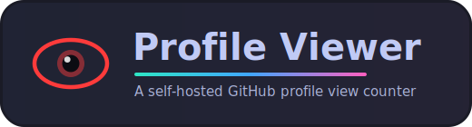
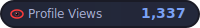
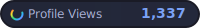
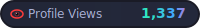
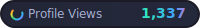
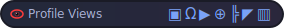
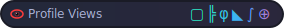

<div align="center">



A simple, self-hosted GitHub profile view counter with a Redis backend.<br/>
Locked to a single username and available in two display modes.


</div>

## Features

- 🚀 Serverless deployment on Vercel
- 📊 View counter with Upstash Redis
- 🎨 SVG badge generation
- 🔒 Locked to a single username (no arbitrary usernames)
- 🔮 Two display modes: a plain counter or random symbols
- 🛡️ Privacy-friendly (no personal data stored)
- ⚡ Fast and lightweight

## Modes

This badge supports exactly two modes, selected via the `mode` query parameter:

| Mode | Parameter | What it shows |
|------|-----------|---------------|
| **Counter** | `mode=counter` (default) | The real view count as a number |
| **Symbols** | `mode=symbols` | Random glitch / geometric / Greek / math symbols, freshly generated on every load |

In **both** modes the real view count is tracked in the background — the symbol
mode simply hides the number behind random symbols.

```markdown
<!-- Normal counter -->


<!-- Random symbols on every load -->

```

### Animated icon

The animated icon left of the label can be switched with the `icon` parameter
(works in both modes):

| Icon | Parameter | Look |
|------|-----------|------|
| **Rainbow eye** | `icon=eye` (default) | An eye whose colour cycles through the rainbow; the pupil looks around |
| **Spinning ring** | `icon=ring` | A rainbow ring that spins like a loader |

```markdown
<!-- Counter with the spinning rainbow ring -->


<!-- Symbols mode with the spinning ring -->

```

### Colour effect on the value

The number / symbols can be coloured with the `effect` parameter (works in both
modes):

| Effect | Parameter | Look |
|--------|-----------|------|
| **Plain** | `effect=none` (default) | Static blue accent colour |
| **Rainbow** | `effect=rainbow` (alias `terminal`) | The value cycles through the rainbow and is followed by a blinking cursor (animated) |
| **Gradient** | `effect=gradient` | A flowing multi-colour gradient (animated) — the colours drift across the value |

```markdown
<!-- Rainbow value with a blinking cursor -->


<!-- Flowing animated gradient on the symbols -->

```

## Gallery

All 12 combinations of mode, icon and effect, as static preview images
(generated from the badge code with `npm run gallery` — viewing them does not
touch the counter).

### Counter mode

| Effect | `icon=eye` | `icon=ring` |
|--------|------------|-------------|
| `none` |  |  |
| `rainbow` |  |  |
| `gradient` |  |  |

### Symbols mode

| Effect | `icon=eye` | `icon=ring` |
|--------|------------|-------------|
| `none` |  |  |
| `rainbow` |  |  |
| `gradient` |  |  |

## Username lock

The counter only responds to **one** username. Any other value of `username`
returns an `Access denied` badge instead of a counter. (The denied badge is
still delivered with HTTP 200, because GitHub's image proxy refuses to render
error responses — the view is simply not counted.)

The allowed username is read from the `ALLOWED_USERNAME` environment variable.
Set it to your own GitHub username in your Vercel project settings — no code
change required. The match is case-insensitive.

## Setup

### 1. Deploy to Vercel

[](https://vercel.com/new/clone?repository-url=https%3A%2F%2Fgithub.com%2F0xGI0%2Fprofile-viewer&env=UPSTASH_REDIS_REST_URL,UPSTASH_REDIS_REST_TOKEN,ALLOWED_USERNAME&envDescription=Upstash%20Redis%20REST%20credentials%20and%20the%20single%20GitHub%20username%20the%20counter%20responds%20to&envLink=https%3A%2F%2Fgithub.com%2F0xGI0%2Fprofile-viewer%23setup)

The button clones this repository into your own GitHub account and asks for
the three environment variables right away:

```env
UPSTASH_REDIS_REST_URL=your-upstash-url
UPSTASH_REDIS_REST_TOKEN=your-upstash-token
ALLOWED_USERNAME=your-github-username
```

The Redis credentials come from [Upstash](https://console.upstash.com/):
create a free account, create a Redis database and copy the REST URL and
token from the database details.

(Alternatively: fork this repository and import the fork manually at
[vercel.com/new](https://vercel.com/new).)

### 2. Use in Your Profile

Replace `your-deployment.vercel.app` with your own Vercel domain and use
your allowed username:

```markdown

```

## Local development

```bash
git clone https://github.com/your-github-username/profile-viewer.git
cd profile-viewer
cp .env.example .env   # fill in your Upstash credentials
npx vercel dev
```

The badge is then served at
`http://localhost:3000/api/views?username=your-github-username`.

## API

### `GET /api/views`

**Parameters:**

| Parameter | Required | Default | Description |
|-----------|----------|---------|-------------|
| `username` | ✅ | – | Must match `ALLOWED_USERNAME`, otherwise an `Access denied` badge is returned |
| `mode` | ❌ | `counter` | `counter` for the number, `symbols` for random symbols |
| `icon` | ❌ | `eye` | `eye` for the rainbow eye, `ring` for the spinning rainbow ring |
| `effect` | ❌ | `none` | Colour effect on the value: `none`, `rainbow` (cycling rainbow + blinking cursor; alias `terminal`) or `gradient` (animated flowing gradient) |
| `demo` | ❌ | – | `demo=1` renders the badge **without counting the view** — the counter shows the current number without incrementing it (used by the examples in this README) |

**Examples:**
```
https://your-deployment.vercel.app/api/views?username=your-github-username
https://your-deployment.vercel.app/api/views?username=your-github-username&mode=symbols
https://your-deployment.vercel.app/api/views?username=your-github-username&icon=ring
https://your-deployment.vercel.app/api/views?username=your-github-username&mode=symbols&icon=ring
https://your-deployment.vercel.app/api/views?username=your-github-username&effect=rainbow
https://your-deployment.vercel.app/api/views?username=your-github-username&mode=symbols&effect=gradient
```

Returns an SVG badge. Responses always use HTTP 200 (including the
`Access denied` badge), because GitHub's image proxy does not display
images from non-2xx responses.

## Privacy

This counter:
- ✅ Only stores an anonymous count
- ✅ No IP addresses logged
- ✅ No personal data collected
- ✅ GDPR compliant

## Tech Stack

- [Vercel Functions](https://vercel.com/docs/functions) - Serverless API
- [Upstash Redis](https://upstash.com/) - Data storage
- SVG - Badge generation

## License

MIT License - see [LICENSE](LICENSE) file

## Contributing

Contributions welcome! Feel free to open issues or pull requests.

---

Made with ❤️ by [0xGI0](https://github.com/0xGI0)
